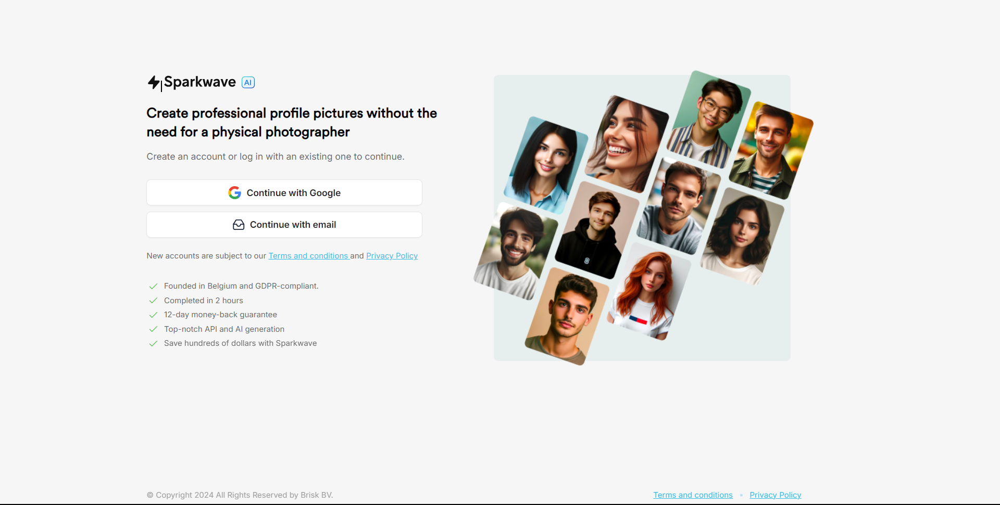
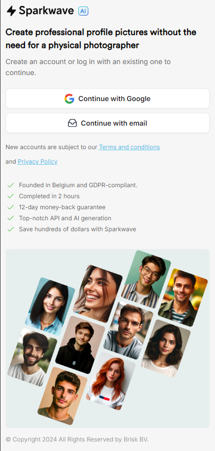
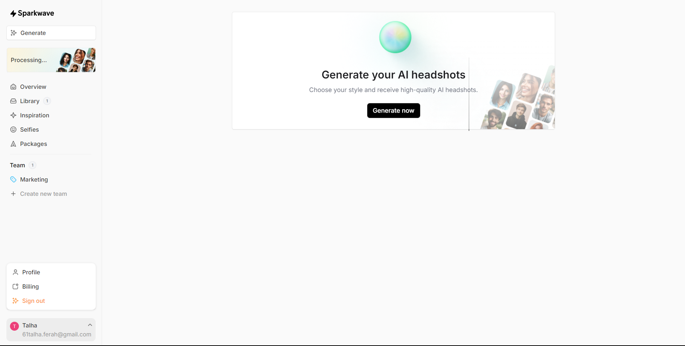
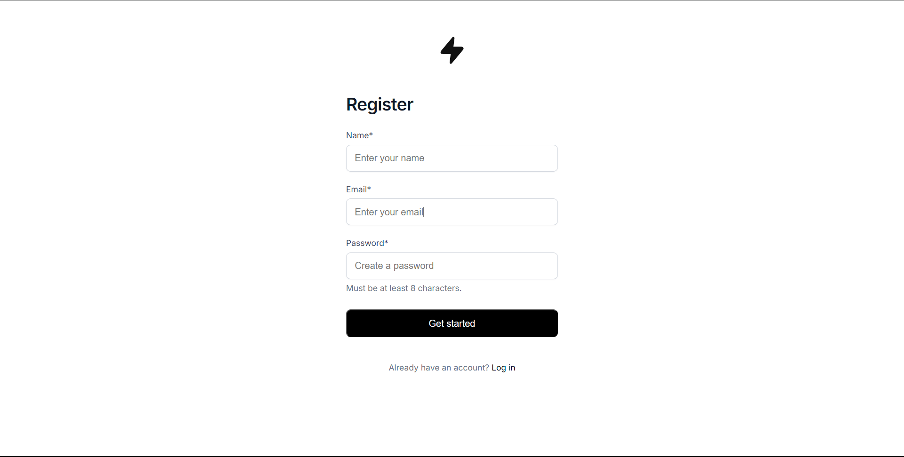
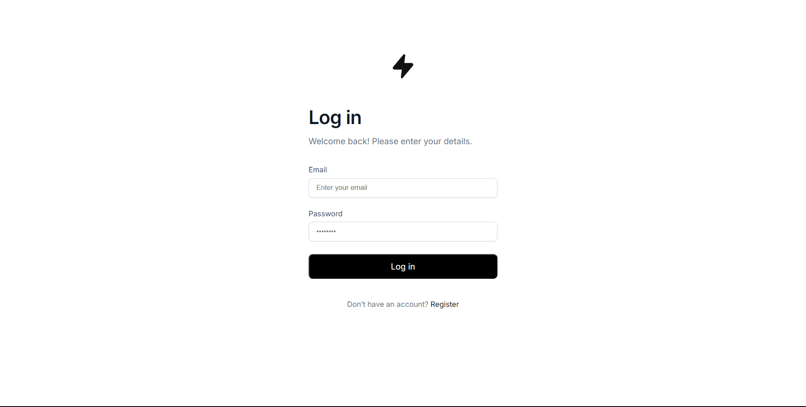
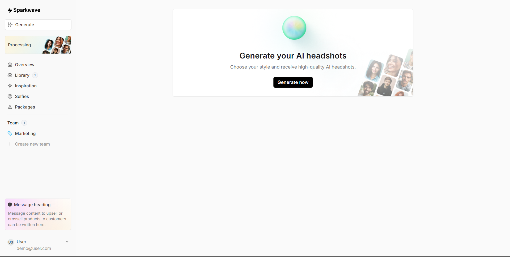
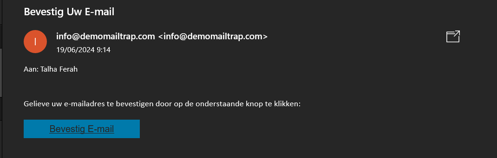
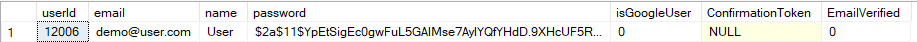

# SparkwaveAi
 
Dit project richt zich op de ontwikkeling van een authenticatiesysteem voor webapplicaties waarbij gebruikers de mogelijkheid hebben om in te loggen via hun Google-account of een persoonlijk e-mailadres. Ik heb zowel de front-end als de back-end zelfstandig ontwikkeld. De ontwerpen heb ik ontvangen van mijn werkplekcoach tijdens mijn stage en ik heb de applicatie gebouwd met speciale aandacht voor pixel-perfecte ontwikkeling

# 📸 Screenshots

<h3>Dashboard Google Gebruiker</h3>

<h3>Dashboard Eigen Email Gebruiker</h3>

<h3>De Email Verificatie Email</h3>

<h3>De User Tabel in SQL Server Management Studio</h3>

